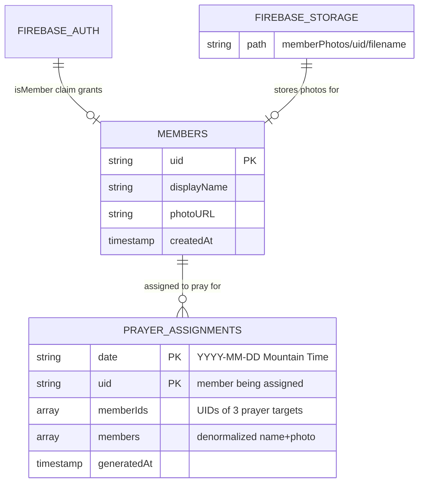

# feat: Add Member-Only Features (Directory + Daily Prayer Partners)

## Overview

Add a member-only feature layer to the Sovereign Hope app that provides two core features gated behind Firebase custom claims:

1. **Member Directory** - A searchable list of church members showing name and photo
2. **Daily Prayer Partners** - 3 randomly-assigned members to pray for each day, unique per member, regenerated nightly

This builds on the existing authentication infrastructure (Apple Sign-In, Google Sign-In, email/password) already implemented on the `codex/cross-device-sync-foundation` branch. Access is enforced at two layers: client-side navigation guards and Firestore security rules using the `isMember` custom claim.

## Problem Statement / Motivation

Church members currently have no way to connect with each other through the app. The app treats all authenticated users identically. Members want to:

- Know who else is in their church community (directory)
- Be prompted to pray for specific fellow members daily (prayer partners)

These features must be **strictly member-only** for privacy and security reasons - non-members must never access member data under any circumstances.

## Proposed Solution

### Architecture Summary (see brainstorm: ../brainstorms/2026-02-26-member-only-features-brainstorm.md)

| Component         | Approach                                                              |
| ----------------- | --------------------------------------------------------------------- |
| Member flag       | Firebase custom claims (`isMember: true`) - tamper-proof, token-level |
| Admin model       | Staff manages via Firebase Console (no in-app admin UI)               |
| Data architecture | Flat Firestore collections: `members/`, `prayerAssignments/`          |
| Security          | Two layers: client navigation guards + Firestore rules                |
| Prayer generation | Scheduled Cloud Function at midnight Mountain Time                    |
| Photo storage     | Firebase Storage with download URLs in member docs                    |
| Token refresh     | Force refresh on app foreground to detect claim changes               |
| Directory data    | Name + photo only, staff-managed                                      |
| Privacy           | No opt-out; membership implies participation                          |

## Technical Approach

### Firestore Schema

```
members/{uid}
  ├── displayName: string
  ├── photoURL: string | null
  ├── createdAt: Timestamp
  └── uid: string

prayerAssignments/{date}/assignments/{uid}
  ├── memberIds: [uid1, uid2, uid3]
  ├── members: [                          // denormalized for single-read performance
  │     { uid, displayName, photoURL },
  │     { uid, displayName, photoURL },
  │     { uid, displayName, photoURL }
  │   ]
  └── generatedAt: Timestamp
```

**Date format:** `YYYY-MM-DD` in Mountain Time (America/Boise). The `{date}` document is a parent document under `prayerAssignments/`, with `assignments/` as a subcollection containing per-member documents.

**Denormalization decision:** Prayer assignment documents include denormalized member data (`members[]` array with name + photo) to avoid 3 additional Firestore reads per prayer screen visit. The Cloud Function populates this at generation time. Stale data (e.g., photo change after assignment) is acceptable since assignments last only one day.

### Firestore Security Rules (additions to existing `firestore.rules`)

```javascript
// Member profiles - readable by any member, writable only by Admin SDK
match /members/{memberId} {
  allow read: if request.auth != null && request.auth.token.isMember == true;
  allow write: if false;
}

// Prayer assignments - members can only read their own
match /prayerAssignments/{date}/assignments/{memberId} {
  allow read: if request.auth != null
               && request.auth.token.isMember == true
               && request.auth.uid == memberId;
  allow write: if false;
}
```

### Firebase Storage Security Rules

```javascript
// Member photos - readable by any member, writable only via Admin SDK/Console
match /memberPhotos/{uid}/{fileName} {
  allow read: if request.auth != null && request.auth.token.isMember == true;
  allow write: if false;
}
```

### Navigation Structure

Add a **"Members" tab** to the bottom tab navigator, visible **only to authenticated members**. Non-members and unauthenticated users see the existing 4 tabs unchanged.

```
Tab.Navigator
  ├── "This Week"      (existing)
  ├── "Reading Plan"   (existing)
  ├── "Church"         (existing)
  ├── "Members"        (NEW - conditional on isMember) ← MemberStack
  │     ├── "Member Directory"  → MemberDirectoryScreen
  │     └── "Daily Prayer"      → DailyPrayerScreen
  └── "Resources"      (existing)
```

**Navigation guard behavior:**

- The "Members" tab is conditionally rendered in the tab navigator based on the `isMember` claim from the auth token
- If a member's claim is revoked mid-session, the tab disappears on the next token refresh (foreground)
- Non-members never see the tab - they cannot even attempt to navigate to it
- Deep links or direct navigation attempts to member screens are blocked by a guard wrapper component

### Auth Token Refresh for Custom Claims

Extend the existing auth infrastructure to force-refresh the ID token on app foreground:

```typescript
// In AppLifecycleSyncEffects or a new hook
AppState.addEventListener("change", async (nextState) => {
  if (nextState === "active" && currentUser) {
    const tokenResult = await currentUser.getIdTokenResult(true);
    const isMember = tokenResult.claims.isMember === true;
    dispatch(setMemberStatus(isMember));
  }
});
```

This leverages the existing `AppState` listener pattern used in `TodayScreen` and `WeekendView`.

### Cloud Functions

#### 1. `generateDailyPrayerAssignments` (Required)

**Trigger:** Scheduled via Cloud Scheduler, runs at `0 0 * * *` America/Boise (midnight Mountain Time)

**Algorithm:**

1. Query all documents in `members/` collection
2. Build array of member UIDs
3. For each member:
   - Filter out self from the pool
   - Randomly select `min(3, pool.length)` members (Fisher-Yates shuffle, take first N)
   - Write to `prayerAssignments/{date}/assignments/{uid}` with both `memberIds[]` and denormalized `members[]`
4. Log success/failure count

**Edge cases:**

- Fewer than 4 total members: assign as many as available (1-2 instead of 3)
- 0-1 members: skip generation, no assignments written
- Function failure: Cloud Scheduler will retry per its default policy. No client-side fallback needed for brief outages.

**Randomization:** Pure random per day. No anti-repeat logic for V1. (Future consideration: weighted distribution for fairness)

#### 2. `cleanupOldPrayerAssignments` (Required)

**Trigger:** Scheduled weekly (Sunday midnight MT)

**Behavior:** Delete all `prayerAssignments/{date}/assignments/*` documents where `{date}` is older than 7 days. Keeps storage bounded.

#### 3. `setMemberClaim` (Required - Admin Helper)

**Trigger:** HTTPS callable function (authenticated, admin-only)

**Purpose:** Simplify the staff workflow. Instead of manually navigating Firebase Console to set custom claims (which is buried in the Auth section), provide a callable function that:

1. Sets `isMember: true` custom claim on the specified UID
2. Creates the `members/{uid}` document with provided `displayName` and `photoURL`
3. Returns success/failure

This reduces the 4-step manual process to a single API call. Can be invoked from a simple admin script or future admin UI.

### Client-Side Architecture

#### New Redux Slice: `src/redux/memberSlice.ts`

```typescript
interface MemberProfile {
  uid: string;
  displayName: string;
  photoURL: string | null;
  createdAt: number;
}

interface PrayerAssignment {
  memberIds: string[];
  members: Array<{ uid: string; displayName: string; photoURL: string | null }>;
  generatedAt: number;
}

interface MemberState {
  isMember: boolean;
  directory: MemberProfile[];
  prayerAssignment: PrayerAssignment | null;
  isLoadingDirectory: boolean;
  isLoadingPrayer: boolean;
  hasDirectoryError: boolean;
  hasPrayerError: boolean;
}
```

**Thunks:**

- `fetchMemberDirectory` - Reads all docs from `members/` collection
- `fetchDailyPrayerAssignment` - Reads `prayerAssignments/{today}/assignments/{uid}`
- `refreshMemberClaim` - Force refreshes auth token, updates `isMember` state

**Selectors:**

- `selectIsMember` - boolean
- `selectMemberDirectory` - MemberProfile[]
- `selectPrayerAssignment` - PrayerAssignment | null
- `selectIsLoadingDirectory` / `selectIsLoadingPrayer`

#### New Screens

**`src/screens/MemberDirectoryScreen/`**

- `MemberDirectoryScreen.tsx` - FlatList of member cards with search
- `MemberDirectoryScreen.styles.ts` - Themed styles

Features:

- Search bar at top (case-insensitive substring match on `displayName`, client-side filtering)
- Each row shows circular photo thumbnail + display name
- Photo fallback: generic person silhouette with member's first initial
- Pull-to-refresh to re-fetch directory
- Empty state when no members found matching search

**`src/screens/DailyPrayerScreen/`**

- `DailyPrayerScreen.tsx` - 3 prayer partner cards
- `DailyPrayerScreen.styles.ts` - Themed styles

Features:

- Header: "Pray for these members today"
- 3 cards showing photo (or fallback) + display name
- Graceful handling of fewer than 3 assignments
- If no assignments exist for today (function hasn't run yet or user is in a timezone ahead of MT): show yesterday's assignments with subtle note, or show a "Prayer partners are being prepared" state
- Pull-to-refresh

#### New Components

**`src/components/MemberAvatar/MemberAvatar.tsx`**

- Circular image component with fallback to initials on colored background
- Reused in both directory list and prayer cards
- Props: `photoURL: string | null`, `displayName: string`, `size: number`

#### AuthUserSnapshot Extension

Extend the existing `AuthUserSnapshot` type in `src/services/auth.ts` to include custom claims:

```typescript
interface AuthUserSnapshot {
  uid: string;
  email: string | null;
  displayName: string | null;
  providerIds: Array<string>;
  isMember: boolean; // NEW - from custom claims
}
```

Update `subscribeToAuthStateChanges` to extract `isMember` from token claims on each auth state change and on foreground refresh.

#### New Service: `src/services/members.ts`

Firebase operations for member data:

- `fetchAllMembers()` - Query `members/` collection
- `fetchPrayerAssignment(uid: string, date: string)` - Read assignment doc
- `getMountainTimeDate()` - Returns today's date string in `YYYY-MM-DD` Mountain Time format

## System-Wide Impact

### Interaction Graph

1. App foregrounds → `AppState` listener fires → `getIdToken(true)` refreshes token → `setMemberStatus()` dispatched → Tab navigator re-renders conditionally
2. Member navigates to Directory tab → `fetchMemberDirectory` thunk dispatched → Firestore read to `members/` → State updated → FlatList renders
3. Member navigates to Prayer screen → `fetchDailyPrayerAssignment` thunk dispatched → Firestore read to `prayerAssignments/{date}/assignments/{uid}` → Cards render
4. Midnight MT → Cloud Function triggers → Reads `members/` → Generates assignments → Writes to `prayerAssignments/{date}/assignments/{uid}` for each member

### Error Propagation

- **Token refresh failure (no network):** `getIdToken(true)` throws → catch and use cached claim state → member features remain accessible based on last known state
- **Firestore read failure (network/permissions):** Thunk rejected → `hasError: true` in slice → Screen shows error state with retry option
- **Cloud Function failure:** Cloud Scheduler retries automatically (default 3x). If all retries fail, no assignments for the day → Client shows fallback (yesterday's or "preparing" state)
- **Storage URL broken:** Image component `onError` → falls back to initials avatar

### State Lifecycle Risks

- **Partial claim set:** Staff sets claim but doesn't create member doc → member can access tab but doesn't appear in directory. Mitigated by `setMemberClaim` Cloud Function that does both atomically.
- **Stale directory cache:** Member removed but directory still shows them until next fetch → acceptable for V1 (pull-to-refresh resolves)
- **Assignment references removed member:** Prayer card shows member who was removed → show "Church member" fallback text if denormalized data is present, since denormalized data persists in the assignment doc

### API Surface Parity

- No external API consumers
- Firestore collections are new (no migration needed)
- Auth token structure is extended (backward compatible - `isMember` defaults to undefined/falsy)

## Acceptance Criteria

### Functional Requirements

- [x] **Custom claims:** Staff can set `isMember: true` claim on a user via the `setMemberClaim` Cloud Function
- [x] **Token refresh:** App force-refreshes auth token on foreground, detecting claim changes within one session cycle
- [x] **Navigation guard:** Members tab appears only for users with `isMember: true` claim
- [x] **Navigation guard:** Non-members never see the Members tab; direct navigation attempts are blocked
- [x] **Directory:** Members can view a scrollable list of all members showing name and photo
- [x] **Directory search:** Members can filter the directory by typing a name (case-insensitive substring match)
- [x] **Directory photos:** Member photos load from Firebase Storage; missing photos show initials fallback
- [x] **Prayer partners:** Members see 3 (or fewer) randomly-assigned prayer partners for today
- [x] **Prayer generation:** Cloud Function generates unique assignments per member nightly at midnight MT
- [x] **Prayer exclusion:** Members never see themselves in their own prayer assignments
- [x] **Prayer edge case:** With fewer than 4 total members, assigns as many as possible (1-2)
- [x] **Firestore rules:** `members/` collection readable only by authenticated users with `isMember` claim
- [x] **Firestore rules:** `prayerAssignments/` readable only by the assigned member (uid match + isMember)
- [x] **Firestore rules:** Both collections have `write: false` for all clients
- [x] **Storage rules:** Member photos readable only by authenticated users with `isMember` claim
- [x] **Member removal:** Revoking `isMember` claim results in loss of access on next app foreground
- [x] **Cleanup:** Old prayer assignments (>7 days) are automatically cleaned up weekly

### Non-Functional Requirements

- [ ] Directory loads in under 2 seconds for up to 500 members
- [ ] Prayer screen loads in under 1 second (single document read with denormalized data)
- [x] Dark mode support for all new screens (using existing theme system)
- [x] Accessible: proper labels for screen readers on member cards and search input

### Quality Gates

- [x] Unit tests for `memberSlice` (thunks, selectors, state transitions)
- [x] Unit tests for `members.ts` service functions
- [x] Unit tests for `MemberAvatar` component (photo loaded, fallback states)
- [ ] Cloud Function unit tests (assignment algorithm, edge cases)
- [ ] Firestore rules tests (member access, non-member blocked, write blocked)
- [ ] Manual testing on both iOS and Android

## Implementation Phases

### Phase 1: Foundation (Custom Claims + Security Rules + Cloud Functions)

**Goal:** Server-side infrastructure in place and tested before any client changes.

**Tasks:**

1. Add `isMember` claim extraction to `AuthUserSnapshot` and `subscribeToAuthStateChanges` in `src/services/auth.ts`
2. Add foreground token refresh hook (extend `AppLifecycleSyncEffects` or create `useMemberClaimRefresh` hook)
3. Update `firestore.rules` with `members/` and `prayerAssignments/` rules
4. Add Firebase Storage security rules for `memberPhotos/`
5. Implement `setMemberClaim` Cloud Function (HTTPS callable)
6. Implement `generateDailyPrayerAssignments` Cloud Function (scheduled)
7. Implement `cleanupOldPrayerAssignments` Cloud Function (scheduled weekly)
8. Deploy and test Cloud Functions in Firebase Emulator
9. Write Firestore rules tests

**Files created/modified:**

- `src/services/auth.ts` (modify - add isMember to snapshot)
- `src/services/members.ts` (new)
- `firestore.rules` (modify)
- `storage.rules` (new or modify)
- `functions/src/index.ts` (modify - add new functions)
- `functions/src/prayerAssignments.ts` (new)
- `functions/src/memberManagement.ts` (new)

**Success criteria:** Custom claims can be set via callable function. Firestore rules block non-members. Scheduled function generates valid assignments in emulator.

### Phase 2: Client State + Navigation Guard

**Goal:** Redux infrastructure and navigation gating in place.

**Tasks:**

1. Create `src/redux/memberSlice.ts` following existing slice patterns
2. Register `memberReducer` in `src/app/store.ts`
3. Add `selectIsMember` selector (reads from auth state or member slice)
4. Create `MemberStack` navigator component in `RootScreen.tsx`
5. Conditionally render "Members" tab based on `selectIsMember`
6. Add `"Member Directory"` and `"Daily Prayer"` to `RootStackParamList`
7. Write `memberSlice` unit tests

**Files created/modified:**

- `src/redux/memberSlice.ts` (new)
- `src/app/store.ts` (modify - add memberReducer)
- `src/navigation/RootNavigator.ts` (modify - add screen types)
- `src/screens/RootScreen/RootScreen.tsx` (modify - add Members tab)

**Success criteria:** Members tab appears/disappears based on claim. Non-members see 4 tabs. Members see 5 tabs.

### Phase 3: Member Directory Screen

**Goal:** Functional directory with search.

**Tasks:**

1. Create `MemberAvatar` component with photo + initials fallback
2. Add `MemberAvatar` to component barrel export (`src/components/index.ts`)
3. Create `MemberDirectoryScreen` with FlatList, search, pull-to-refresh
4. Create `MemberDirectoryScreen.styles.ts` with themed styles
5. Wire up `fetchMemberDirectory` thunk to screen lifecycle
6. Write component and screen tests

**Files created/modified:**

- `src/components/MemberAvatar/MemberAvatar.tsx` (new)
- `src/components/MemberAvatar/MemberAvatar.styles.ts` (new)
- `src/components/index.ts` (modify)
- `src/screens/MemberDirectoryScreen/MemberDirectoryScreen.tsx` (new)
- `src/screens/MemberDirectoryScreen/MemberDirectoryScreen.styles.ts` (new)

**Success criteria:** Directory displays all members with photos, search filters correctly, pull-to-refresh works.

### Phase 4: Daily Prayer Screen

**Goal:** Prayer partner cards displaying correctly.

**Tasks:**

1. Create `DailyPrayerScreen` with prayer partner cards
2. Create `DailyPrayerScreen.styles.ts` with themed styles
3. Implement `getMountainTimeDate()` utility for consistent date handling
4. Wire up `fetchDailyPrayerAssignment` thunk
5. Handle edge cases: no assignments yet (fallback to yesterday), fewer than 3 partners
6. Write screen tests

**Files created/modified:**

- `src/screens/DailyPrayerScreen/DailyPrayerScreen.tsx` (new)
- `src/screens/DailyPrayerScreen/DailyPrayerScreen.styles.ts` (new)
- `src/services/members.ts` (modify - add date utility)

**Success criteria:** Prayer screen shows 3 cards with correct data. Gracefully handles edge cases. Falls back when today's assignments unavailable.

### Phase 5: Polish + Testing

**Goal:** Production-ready quality.

**Tasks:**

1. Dark mode verification for all new screens
2. Accessibility audit (screen reader labels, touch targets)
3. Error state UI for all failure modes (network, permissions, empty states)
4. Loading states with appropriate skeletons/spinners
5. End-to-end testing with Firebase Emulator
6. Test member removal flow (revoke claim → verify access lost)
7. Test across both iOS and Android
8. Screenshot documentation for PR

**Success criteria:** All acceptance criteria met. Works on both platforms. Error states handled gracefully.

## Alternative Approaches Considered

(see brainstorm: ../brainstorms/2026-02-26-member-only-features-brainstorm.md)

| Approach                                 | Why Rejected                                                                         |
| ---------------------------------------- | ------------------------------------------------------------------------------------ |
| Nested Firestore (under users/)          | Harder to query across members; collection group queries add complexity              |
| Embedded assignments in member docs      | Documents grow over time; mixed write permissions (staff vs function)                |
| Client-side prayer generation            | Requires full member list on client; less secure; harder to guarantee uniqueness     |
| On-demand Cloud Function for prayer      | Slower first load; concurrent request handling complexity                            |
| Firestore document field for member flag | Can potentially be tampered with if rules aren't perfect; custom claims are stronger |
| In-app admin UI                          | Premature; prove the features before investing in admin infrastructure               |

## Dependencies & Prerequisites

- **Auth infrastructure** - Already implemented on `codex/cross-device-sync-foundation` branch (Apple, Google, email/password sign-in, authSlice, sync service)
- **Firebase Cloud Functions** - `functions/` directory exists with `cleanupDeletedUserData` function. New functions will be added alongside it.
- **Firebase Storage** - Must be enabled in Firebase Console (may already be enabled)
- **Cloud Scheduler** - Required for scheduled Cloud Functions (enabled automatically with Firebase)

## Risk Analysis & Mitigation

| Risk                                                   | Likelihood       | Impact                            | Mitigation                                                               |
| ------------------------------------------------------ | ---------------- | --------------------------------- | ------------------------------------------------------------------------ |
| Staff forgets to create member doc after setting claim | Medium           | Member sees empty directory entry | `setMemberClaim` function atomically sets claim + creates doc            |
| Cloud Function fails on a given night                  | Low              | No prayer partners for the day    | Cloud Scheduler retry policy + client falls back to previous day         |
| Token refresh fails (no network)                       | Medium           | Stale claim state                 | Use cached claim; member features remain based on last known state       |
| Large member count slows directory                     | Low (church app) | Slow UI                           | Client-side filtering; FlatList virtualization handles 500+ members      |
| Photo URL becomes invalid                              | Low              | Broken image                      | MemberAvatar fallback to initials                                        |
| Timezone confusion for prayer dates                    | Medium           | Wrong day's assignments           | `getMountainTimeDate()` utility used consistently; documented convention |

## Timezone Strategy

**Convention:** All dates in `prayerAssignments/{date}` use Mountain Time (America/Boise) in `YYYY-MM-DD` format. This is the church's local timezone.

**Client behavior:** The `getMountainTimeDate()` utility converts the current UTC time to Mountain Time to determine "today's" date string. This means:

- A user in Eastern Time at 11 PM ET sees Mountain Time's date (which is 9 PM MT = same calendar day)
- A user in UTC+12 at 2 AM their time sees Mountain Time's date (which is the previous calendar day)
- If no assignment exists for the computed date (function hasn't run yet), fall back to the previous day

This is acceptable because the church is in one timezone and most users are local.

## Offline Behavior

- **Directory:** Show cached data from last fetch (Redux state persists during session). No cross-session caching for V1 - directory shows loading/error on cold start without network.
- **Prayer assignments:** Same as directory - session-cached only.
- **Token refresh:** Fails silently, uses cached claim state. Member features remain accessible based on last known claim.
- **Existing pattern:** The app already has `NoNetworkComponent` that can be reused for error states.

## Staff Workflow Documentation

### Adding a New Member

1. User creates an account in the app (Apple, Google, or email sign-in)
2. Staff calls `setMemberClaim` Cloud Function with user's UID, display name, and photo URL:
   ```bash
   # Via Firebase CLI or admin script
   firebase functions:call setMemberClaim --data '{"uid": "abc123", "displayName": "John Smith", "photoURL": "https://..."}'
   ```
3. Function sets `isMember: true` custom claim and creates `members/{uid}` document
4. Next time the user foregrounds the app, they see the "Members" tab

### Removing a Member

1. Staff calls `setMemberClaim` with `isMember: false` (or removes the claim)
2. Function removes the `members/{uid}` document
3. Next time the user foregrounds the app, the "Members" tab disappears
4. Firestore rules immediately block any direct data access

### Updating a Member Profile

1. Staff updates the `members/{uid}` document directly in Firebase Console (or via admin script)
2. Changes are reflected immediately for other members on next directory fetch

## ERD



## Success Metrics

- Members tab visible only to users with `isMember` claim (zero leakage)
- Directory loads all members within 2 seconds
- Prayer assignments generated successfully every night (monitor via Cloud Function logs)
- No Firestore security rule violations in Firebase Console audit logs

## Future Considerations (Not In Scope)

- In-app admin interface for managing members
- Additional directory fields (contact info, small group, ministry)
- Member opt-out from directory or prayer rotation
- Prayer tracking ("prayed for" with streaks or history)
- Push notifications for daily prayer reminders
- Admin role with custom claims (`isAdmin`) for in-app management
- Cross-session offline caching (AsyncStorage for member data)

## Sources & References

### Origin

- **Brainstorm document:** [../brainstorms/2026-02-26-member-only-features-brainstorm.md](../brainstorms/2026-02-26-member-only-features-brainstorm.md) - Key decisions carried forward: Firebase custom claims for member flag, flat Firestore collections, two-layer security model, scheduled Cloud Function for prayer generation

### Internal References

- Auth infrastructure: `src/services/auth.ts`, `src/redux/authSlice.ts`
- Redux slice pattern: `src/redux/settingsSlice.ts` (canonical example)
- Screen pattern: `src/screens/SettingsScreen/` (directory + styles + tests)
- Navigation registration: `src/screens/RootScreen/RootScreen.tsx` (tab navigator)
- Navigation types: `src/navigation/RootNavigator.ts` (RootStackParamList)
- Store registration: `src/app/store.ts`
- Component barrel: `src/components/index.ts`
- Style system: `src/style/themes.ts`, `src/style/colors.ts`, `src/style/typography.ts`, `src/style/layout.ts`
- Typed hooks: `src/hooks/store.ts` (useAppSelector, useAppDispatch)
- AppState pattern: `src/screens/TodayScreen/` (foreground listener)
- Cloud Functions: `functions/index.js` (existing cleanupDeletedUserData)
- Firestore rules: `firestore.rules`
- Test utilities: `jest/testUtils.tsx` (Redux-wrapped render)
- No-network component: `src/components/NoNetworkComponent/`
